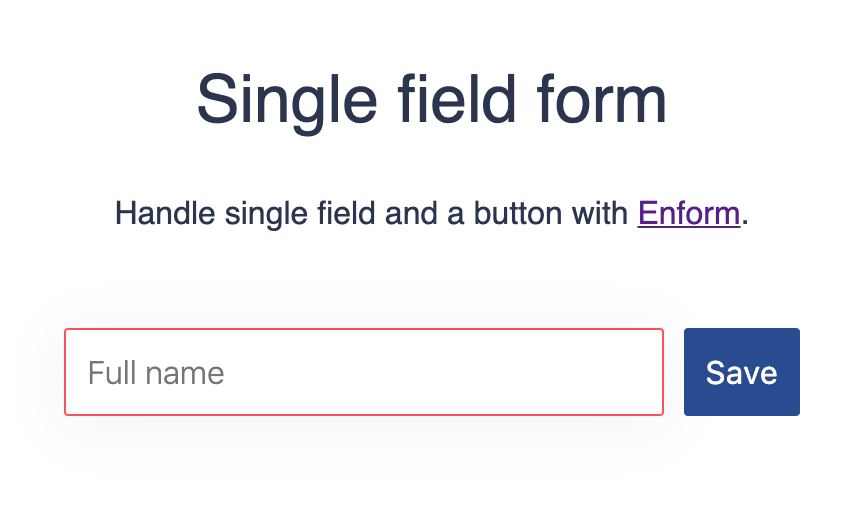

<div align="center">
<a id="enform" href="#enform">
  
</a>

<h3>Handle React forms with joy</h3>

<br />

[](https://circleci.com/gh/moubi/swipeable-react)
[](https://lgtm.com/projects/g/moubi/enform/context:javascript)
[](https://www.npmjs.com/package/enform)
[](#development)
[](LICENSE)

[Usage](docs/index.md#basic-form-field-and-a-button) • [Examples](docs/index.md#documentation) • [API](docs/index.md#api) • [Contribute](#contributing) • [License](LICENSE)
</div>

#### `<Enform />` helps you manage:
 - form validation
 - form dirty state
 - form submission and reset
 - field values and changes
 - error messages

Forms in React are common source of frustration and code repetition. Enform moves that hassle out of the way.

**✔️ Check the [docs with live demos](docs/index.md#documentation) or jump to the [basic usage](#basic-usage).**

## So, handling form state?
Yes, in a beautiful way. Working with forms in React could be turned into straightforwad and enjoyable process. **`<Enform />` makes that possible "the React way" by providing intuitive access to the form state (field values/errors) together with a handy set of API methods to modify it.**

## Basic usage


```jsx
import React from "react";
import Enform from "enform";

const App = () => (
  <div>
    <h1>Simple form</h1>
    <Enform
      initial={{ name: "" }}
      validation={{ name: values => values.name === "" }}
    >
      {props => (
        <div>
          <input
            className={props.errors.name ? "error" : ""}
            type="text"
            value={props.values.name}
            onChange={e => {
              props.onChange("name", e.target.value);
            }}
          />
          <button onClick={props.onSubmit}>Submit</button>
        </div>
      )}
    </Enform>
  </div>
);
```
[](https://codesandbox.io/s/newsletter-form-with-enform-dv69b?fontsize=14&hidenavigation=1&theme=dark)

**View more intereactive [examples here](docs/index.md#documentation)**.

This [⚠️ note on re-rendering](docs/index.md#%EF%B8%8F-note-on-re-rendering) may be useful in the scenario where default values in `initial` prop change between renders, but the actual object passed remain the same (by `ref`).

## Install
```
yarn add enform
```

### Requirements ✅
Enform is using React hooks ↩ as per `v2.0.0`.

Consumer projects should have <kbd>react >= 16.8.0</kbd> (the one with hooks) in order to use it.

## API
### Component props
| Prop          | Type          | Required | Description |
| ------------- | ------------- | -------- | ----------- |
| children      | function      | yes      | Function that your need to wrap your DOM with. It accepts the `props` object to help with form state manipulation. |
| [initial](docs/index.md#initial--fieldname-value----required)       | object        | yes      | Initial form field values in a form of `{ fieldName: value, ... }`. |
| [validation](docs/index.md#validation--fieldname-functionvalues--boolstring-)    | object        | no       | Validation for the fields. It takes the form of `{ fieldName: function, ... }` where the `function(values)` accepts all form field values and should return either an error message or truthy/falsey value. Example: `{ username: values => values.username === "" ? "This field is required" : false }`. |

✔️ Read more about these props [here](docs/index.md#enform-component-props).

### State Api
Enform exposes its handy Api by passing an `object` down to the function wrapper.
```jsx
<Enform initial={{ name: "" }}>
  {props => (
    <form />
      ...
    </form>
  )}
</Enform>
```
**The `props` object contains 2 data items:**
|prop|Description|
|-|-|
| [values](docs/index.md#propsvalues--fieldname-value-)&nbsp;&nbsp;&nbsp;&nbsp;&nbsp;&nbsp;&nbsp;&nbsp;&nbsp;&nbsp;&nbsp;&nbsp;&nbsp;&nbsp; |  Current field values - `{ fieldName: value, ... }`. |
| [errors](docs/index.md#propserrors--fieldname-value-)&nbsp;&nbsp;&nbsp;&nbsp;&nbsp;&nbsp;&nbsp;&nbsp;&nbsp;&nbsp;&nbsp;&nbsp;&nbsp;&nbsp; | Current field errors - `{ fieldName: errorMessage, ... }`. |

**and these 7 methods:**

|method|Description|
|-|-|
| [onChange](docs/index.md#propsonchange-fieldname-value--void)     |  Updates single field's value - `onChange(fieldName, value)`. The `value` is usually what what comes from `e.target.value`. **Side effects:** clears previously set field error. |
| [onSubmit](docs/index.md#propsonsubmit-functionvalues--void--void)     | `onSubmit(successCallback)`. Usually attached to a button click or directly to `<form />` onSubmit. `successCallback(values)` will only be executed if all validations pass. **Side effects:** triggers validation or calls successCallback. |
| [reset](docs/index.md#propsreset---void)   | Empties form elements. |
| [isDirty](docs/index.md#propsisdirty---bool)      |  Reports if the form is dirty. It takes into account the `initial` field values passed to `<Enform />`. |
| [validateField](docs/index.md#propsvalidatefield-fieldname--bool)&nbsp;&nbsp;&nbsp;&nbsp; | Triggers single form field validation - `validateField(fieldName)`. |
| [clearError](docs/index.md#propsclearerror-fieldname--void)    | Clears single form field's error - `clearError(fieldName)`. |
| [clearErrors](docs/index.md#propsclearerrors---void)   | Clears all errors in the form. |

`props.values` get updated with `onChange` and `reset` calls.

`props.errors` get updated with `onChange`, `onSubmit`, `reset`, `validateField`, `clearError` and `clearErrors` calls.

✔️ See more details about [Enform's state API](docs/index.md#enform-state-api).

## [Documentation](docs/index.md)
Docs has its own home [here](docs/index.md#documentation). It further expands on the topics covered previously. Many [examples](docs/index.md#examples) and [how to guides](docs/index.md#how-to) for variety of use cases take place on its pages too. Ref to this [⚠️ note on re-rendering](docs/index.md#%EF%B8%8F-note-on-re-rendering) for a common pitfall case.

## Development
Run tests with `jest` in watch mode
```
yarn test
```
or no watch

```
yarn test:nowatch
```
Get gzip size by
```
yarn size
```

Build with
```
yarn build
```
That will pipe `src/Enform.js` through babel and put it as `index.js` under `lib/` folder.

## Contributing
You are welcome to open pull requests, issues with bug reports (use [codesandbox](https://codesandbox.io/)) and suggestions or simply **tweet about Enform**. Check the relavant [guides here](CONTRIBUTING.md).

**Immediate and fun contrubution:** help create more usable examples. Is it a full-fetured form, third party integration or a filter form with bunch of options - feel free fork the [basic form in codesandbox](https://codesandbox.io/s/basic-form-with-enform-dv69b).

## Inspiration
Enform is inspired by my experience with form refactoring, [@jaredpalmer](https://jaredpalmer.com/)'s great work on [Formik](https://github.com/jaredpalmer/formik) and the way [@kamranahmedse](https://github.com/kamranahmedse)'s presented [driver.js](https://github.com/kamranahmedse/driver.js).

## Authors
Miroslav Nikolov ([@moubi](https://github.com/moubi))

## License
[MIT](LICENSE)
