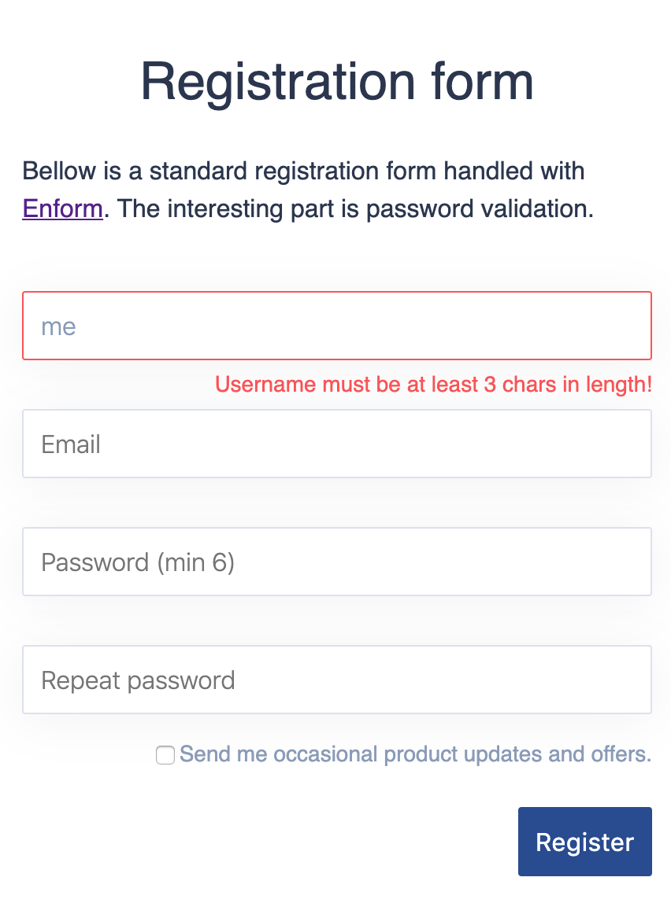
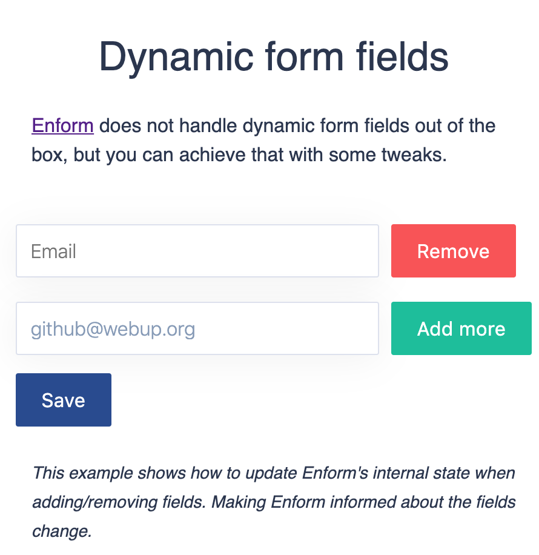
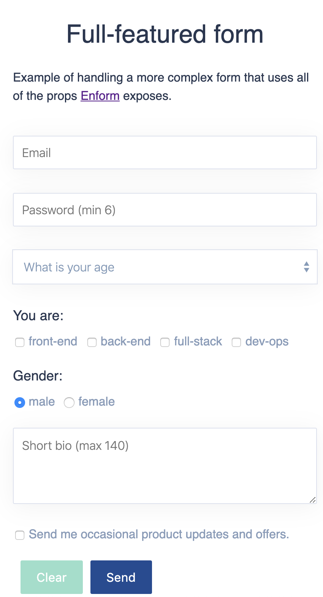

 # Documentation

 - [Overview](#overview)
 - [Examples](#examples)
    - [Basic form (field and a button)](#basic-form-field-and-a-button)
    - [Newsletter form](#newsletter-form)
    - [Registration form](#registration-form)
    - [Form with dynamic elements](#form-with-dynamic-elements)
    - [Full-featured form](#full-featured-form)
  - [API](#api)
    - [Enform component props](#enform-component-props)
      - [initial](#initial--fieldname-value----required)
      - [validation](#validation--fieldname-functionvalues--boolstring-)
    - [Enform state API](#enform-state-api)
      - [props.values](#propsvalues--fieldname-value-)
      - [props.errors](#propserrors--fieldname-value-)
      - [props.onChange](#propsonchange-fieldname-value--void)
      - [props.onSubmit](#propsonsubmit-functionvalues--void--void)
      - [props.reset](#propsreset---void)
      - [props.isDirty](#propsisdirty---bool)
      - [props.validateField](#propsvalidatefield-fieldname--bool)
      - [props.clearError](#propsclearerror-fieldname--void)
      - [props.clearErrors](#propsclearerrors---void)
 - [How to](#how-to)
    - [handle validation](#handle-validation)
    - [reset a form](#reset-a-form)
    - [submit a form](#submit-a-form)
    - [disable button based on dirty state](#disable-button-based-on-dirty-state)
    - [handle contentEditable elements](#handle-contenteditable-elements)
    - [handle form-like DOM](#handle-form-like-dom)

## Overview
Enform was born while trying to deal with forms in React repetitive times with store involved in the picture. Let's face it, things always end up the same. Often the process looks like that - start building the form in existing component, some DOM is added, then it's time to handle user inputs and validation. The result is a big state object to manage and a bunch of component methods to handle changes, submission and validation.

It feels like these should be somehow hidden or extracted away in another component. `<Enform />` is such a component. **It nicely hides that frustration while still keeps the power of forms in React. And it's only 2 kB ✨**.

Ok, enough theory, let's see some real use cases.

## Examples
All examples in this section are available in [Codesandbox](https://codesandbox.io/s/basic-form-with-enform-dv69b) with the latest version of Enform. Feel free to experiment, fork or share. Ping me if you think I have messed something up 🤭.

### Basic form (field and a button)


```jsx
import React from "react";
import Enform from "enform";

const App = () => (
  <div>
    <h1>Simple form</h1>
    <Enform
      initial={{ name: "" }}
      validation={{ name: values => values.name === "" }}
    >
      {props => (
        <div>
          <input
            className={props.errors.name ? "error" : ""}
            type="text"
            value={props.values.name}
            onChange={e => {
              props.onChange("name", e.target.value);
            }}
          />
          <button onClick={props.onSubmit}>Submit</button>
        </div>
      )}
    </Enform>
  </div>
);
```
[](https://codesandbox.io/s/newsletter-form-with-enform-dv69b?fontsize=14&hidenavigation=1&theme=dark)

**Few things to note here:**
 - `initial` (required) prop is set with the field's default value
 - `validation` object defines the field should not be empty
 - `props.onSubmit` is bound to the button click. It will submit whenever validation is passed
 - the input field is fully controlled with the help of `props.values` and `props.onChange`.
___

### Newsletter form


```jsx
<Enform
  initial={{ email: "" }}
  validation={{
    email: values =>
      !/^[A-Za-z0-9._%+-]{1,64}@(?:[A-Za-z0-9-]{1,63}\.){1,125}[a-z]{2,63}$/.test(
        values.email
      )
  }}
>
  {props => (
    <div>
      <input
        className={props.errors.email ? "error" : ""}
        type="text"
        placeholder="Your email"
        value={props.values.email}
        onChange={e => {
          props.onChange("email", e.target.value);
        }}
      />
      <button onClick={props.onSubmit}>Submit</button>
    </div>
  )}
</Enform>
```
[](https://codesandbox.io/s/newsletter-form-with-enform-t1zyk?fontsize=14&hidenavigation=1&theme=dark)

In this example `validation` is set for the email field using RegEx. It will return `true` if email is invalid or `false` otherwise. All [validator functions](#validation--fieldname-functionvalues--boolstring-) must return truthy/falsy value.
___

### Registration form


```jsx
<Enform
  initial={{
    user: "",
    email: "",
    password: "",
    repeatPassword: "",
    news: false
  }}
  validation={{
    // Other fields validation here
    password: values => {
      if (values.password.length < 6) {
        return "Password must be at least 6 chars in length!";
      } else if (values.password !== values.repeatPassword) {
        return "Password doesn't match!";
      }
      return false;
    },
    repeatPassword: values =>
      values.repeatPassword.length < 6
        ? "Password must be at least 6 chars in length!"
        : false
  }}
>
  {props => (
    <div className="Form">
      // Other fields DOM here
      <div className={errors.password ? "error" : ""}>
        <input
          type="password"
          placeholder="Password (min 6)"
          value={props.values.password}
          onChange={e => {
            props.onChange("password", e.target.value);
            if (props.errors.repeatPassword) {
              props.clearError("repeatPassword");
            }
          }}
        />
        <p>{props.errors.password}</p>
      </div>
      ...
    </div>
  )}
</Enform>
```
[](https://codesandbox.io/s/registration-form-with-enform-u6up9?fontsize=14&hidenavigation=1&theme=dark)

This example is shortened, so that it's easy to focus on two interesting parts - **password validation** and **clearing errors**. Take a look at the [full demo in the codesandbox](https://codesandbox.io/s/registration-form-with-enform-u6up9?fontsize=14&hidenavigation=1&theme=dark).

This registration form displays error messages as well. In order that to work each validator function must return the error string or `false` in case of no error. The `password` validation depends on both password and repeatPassword values, so it will display two different error messages.

**Secondly**, password's `onChange` should also clear the error for `repeatPassword`. `props.onChange("password", e.target.value)` does so for the password field, but it needs to be done for repeatPassword as well. That can be achieved by calling `props.clearError("repeatPassword")`.
___

### Form with dynamic elements


```jsx
<Enform
  // Force Enform to reinitialize itself when adding/removing fields
  key={fieldNames.length}
  initial={{
    email: "",
    // Spread updated fields initial values -
    // stored in the component's state.
    ...this.state.fields
  }}
  validation={{
    email: values =>
      !/^[a-zA-Z0-9._%+-]{1,64}@(?:[a-zA-Z0-9-]{1,63}\.){1,125}[a-zA-Z]{2,63}$/.test(
        values.email
      ),
    // Spread the validation object for the rest of the fields -
    // stored in the component's state.
    ...this.state.fieldsValidation
  }}
>
  {props => (
    <div>
      {/* Map your newly added fields to render in the DOM */}
      {Object.keys(this.state.fields).map(field => (
        <div key={field}>
          <input
            className={props.errors[field] ? "error" : ""}
            type="text"
            placeholder="Email"
            value={props.values[field]}
            onChange={e => {
              props.onChange(field, e.target.value);
            }}
          />
          <button className="remove">Remove</button>
        </div>
      ))}
      <input
        className={props.errors.email ? "error" : ""}
        type="text"
        placeholder="Email"
        value={props.values.email}
        onChange={e => {
          props.onChange("email", e.target.value);
        }}
      />
      <button className="add">Add more</button>
      <button className="save">Save</button>
    </div>
  )}
</Enform>
```
[](https://codesandbox.io/s/dynamic-form-fields-with-enform-bnho9?fontsize=14&hidenavigation=1&theme=dark)

Enfrom does not automatically handle dynamic form elements (adding or removing felds), but it is possible to make it aware of such changes with few adjustments. The example above is a short version of the [codesandbox demo](https://codesandbox.io/s/dynamic-form-fields-with-enform-bnho9?fontsize=14&hidenavigation=1&theme=dark).

**Let's start with the basics:** Enform wraps the form DOM and helps with handling its state. But it's required to make Enform aware when new DOM is added, just because it needs to be controlled being a form element. In this example **Enform is forced to reinitialize** whenever more fields are added or removed. It is done by setting the `key={fieldNames.length}` prop.

Next logical step would be to **update** the `initial` and `validation` props with up to date fields data. *The data could be stored in the consumer's component state fx*. Last thing to do - render all these newly added fields. Enform will do the rest as usual.
___

### Full-featured form


```jsx
<Enform
  initial={{
    email: "",
    password: "",
    age: "",
    frontend: false,
    backend: false,
    fullstack: false,
    devops: false,
    gender: "male",
    bio: "",
    news: false
  }}
  validation={{
    email: ({ email }) =>
      !/^[A-Za-z0-9._%+-]{1,64}@(?:[A-Za-z0-9-]{1,63}\.){1,125}[A-Za-z]{2,63}$/.test(
        email
      )
        ? "Enter valid email address!"
        : false,
    password: ({ password }) =>
      password.length < 6
        ? "Password must be at least 6 chars in length!"
        : false,
    age: ({ age }) => (age === "" ? "Select age range" : false),
    bio: ({ bio }) => (bio.length > 140 ? "Try to be shorter!" : false)
  }}
>
  {props => (
    <div className="form">
      <div>
        <input
          type="text"
          placeholder="Email"
          value={props.values.email}
          onChange={e => {
            props.onChange("email", e.target.value);
            // This will validate on every change.
            // The error will disappear once email is valid.
            if (props.errors.email) {
              props.validateField("email");
            }
          }}
        />
        <p>{props.errors.email}</p>
      </div>
      <div>
        <input
          type="password"
          placeholder="Password (min 6)"
          value={props.values.password}
          onChange={e => {
            props.onChange("password", e.target.value);
          }}
        />
        <p>{props.errors.password}</p>
      </div>
      <div>
        <select
          value={props.values.age}
          onChange={e => {
            props.onChange("age", e.target.value);
          }}
        >
          <option value="">What is your age</option>
          <option value="10-18">10 - 18</option>
          <option value="19-25">19 - 25</option>
          <option value="26-40">26 - 40</option>
          <option value="41-67">41 - 67</option>
        </select>
        <p>{props.errors.age}</p>
      </div>
      <label>You are:</label>
      <div>
        <input
          type="checkbox"
          id="frontend"
          checked={props.values.frontend}
          onChange={e => {
            props.onChange("frontend", e.target.checked);
          }}
        />
        <label htmlFor="frontend">front-end</label>
        <input
          type="checkbox"
          id="backend"
          checked={props.values.backend}
          onChange={e => {
            props.onChange("backend", e.target.checked);
          }}
        />
        <label htmlFor="backend">back-end</label>
        <input
          type="checkbox"
          id="fullstack"
          checked={props.values.fullstack}
          onChange={e => {
            props.onChange("fullstack", e.target.checked);
          }}
        />
        <label htmlFor="fullstack">full-stack</label>
        <input
          type="checkbox"
          id="devops"
          checked={props.values.devops}
          onChange={e => {
            props.onChange("devops", e.target.checked);
          }}
        />
        <label htmlFor="devops">dev-ops</label>
      </div>
      <label>Gender:</label>
      <div>
        <input
          type="radio"
          id="male"
          name="gender"
          value="male"
          checked={props.values.gender === "male"}
          onChange={() => {
            props.onChange("gender", "male");
          }}
        />
        <label htmlFor="male">male</label>
        <input
          type="radio"
          id="female"
          name="gender"
          value="female"
          checked={props.values.gender === "female"}
          onChange={() => {
            props.onChange("gender", "female");
          }}
        />
        <label htmlFor="female">female</label>
      </div>
      <div>
        <textarea
          type="text"
          placeholder="Short bio (max 140)"
          value={props.values.bio}
          onFocus={() => {
            // Clear the error on field focus
            props.clearError("bio");
          }}
          onChange={e => {
            props.onChange("bio", e.target.value);
          }}
        />
        <p>{props.errors.bio}</p>
      </div>
      <div>
        <input
          id="news"
          type="checkbox"
          checked={props.values.news}
          onChange={e => {
            props.onChange("news", e.target.checked);
          }}
        />
        <label htmlFor="news">
          Send me occasional product updates and offers.
        </label>
      </div>
      <button
        disabled={!props.isDirty()}
        type="reset"
        onClick={() => {
          // Reverts fields back to initial values
          // and clears all errors
          props.reset();
        }}
      >
        Clear
      </button>
      <button
        onClick={() => {
          props.onSubmit(values => {
            // Call your own handler function here
            alert(JSON.stringify(values, null, " "));
          });
        }}
      >
        Send
      </button>
    </div>
  )}
</Enform>
```
[](https://codesandbox.io/s/full-featured-form-with-enform-qw3tu?fontsize=14&hidenavigation=1&theme=dark)

Demonstration of Enform handling full-featured form, using all API props and methods.

**Few interesting points:**
 - **Passing custom callback to `onSubmit`.** The handler is attached to the submit button and simply alerts all field values in pretty format.
 - **Resetting the form.** With the `props.reset()` call fields are reverted back to `initial` values and all errors are cleared.
 - **Clear error on focus.** This is done by calling `props.clearError("bio")` when focusing the bio field.
 - **Validate while typing.** Calling `props.validateField("email")` as part of the `onChange` handler will trigger validation for each change.
___

## API
`<Enform />` component wraps the form DOM (or custom component) and enables state control via `props`. They are split in two groups - props set to `<Enform />` directly and props that it passes down to the consumer component (DOM).

### Enform component props
Two props can be set to the component itself - `initial` and `validation`.
```jsx
<Enform
  initial={{ username: "" }}
  validation={{ username: values => values.username.length === 0 }}
>
  ...
</Enform>
```

#### `initial: { fieldName: value }` - required
The prop is the only **required one**. It is so, because it needs to tell Enform what is the current field structure. The initial value of each field should be a valid React element's value. That means if there is a `checkbox` fx. it make sense for its initial value to be `boolean`. The structure could be something like `{ email: "", password: "", newsletter: false }`.

#### `validation: { fieldName: function(values) => bool|string) }`
It is used for specifying validation conditions and error messages. Don't set it if validation is not needed. The `key` (field name) should be the same as in the `initial`. The `value` is a validator function which accepts all field values. Validators should return an **error message** when field is invalid or just a **boolean** if no messages are needed. The following: `{ username: values => values.username.length === 0 }` returns a boolean simply telling if the field is empty. Such a condition is useful when setting an error class to the field is enough. Setting up error messages could be achieved with something like that `{ username: values => values.username.length === 0 ? "This field is required" : "" }`.
___

### Enform state API
Enform manages the form's state and provides access to it by exposing several props and methods. These are passed down to the component (DOM) via the `props` object.

```jsx
<Enform initial={{ name: "" }}>
  {props => (
    <form />
      ...
    </form>
  )}
</Enform>
```

#### `props.values: { fieldName: value }`
Object containing all field values. The signature is `{ fieldName: value }` where `fieldName` is the field name as defined in the [initial](#initial--fieldname-value----required) and `value` is the current value of the element.

`props.values` get updated when calling:
 - props.onChange
 - props.reset

#### `props.errors: { fieldName: value }`
Object containing errors for all fields. These are either the error messages or simply true|false values. `fieldName` is the same field name defined in the [initial](#initial--fieldname-value----required) while `value` is returned from the validator function (error message or boolean) defined in [validation](#validation--fieldname-functionvalues--boolstring-). In case of no error `props.errors.<fieldName>` should be `false` or any falsy value returned from the validator.

`props.errors` get updated when calling:
 - props.onChange
 - props.onSubmit
 - props.validateField
 - props.clearError
 - props.clearErrors
 - props.reset

#### `props.onChange: (fieldName, value) => void`
Handler method used for setting the value of a field.

```jsx
<Enform initial={{ email: "" }}>
  {props => (
    ...
    <input onChange={e => {
      props.onChange("email", e.target.value);
    }}>
  )}
</Enform>
```
As a **side effect** calling this method will also **clear** previously set error for that field.

#### `props.onSubmit: (function(values) => void) => void`
By calling `props.onSubmit()` Enform will do the following: **trigger validation** on all fields and either set the corresponding **errors** or **call** the `successCallback` if validation is passed. `successCallback` accepts the `values` object as an argument.

```jsx
<Enform initial={{ email: "" }}>
  {props => (
    <form onSubmit={e => {
      e.preventDefault();
      props.onSubmit(values => { console.log(values); });
    }}>
      ...
    </form>
  )}
</Enform>
```

#### `props.reset: () => void`
Clears all fields and errors. Calling `props.reset()` will set the fields back to their `initial` values. As a side effect it will also clear the errors as if `props.clearErrors()` was called. The following [full-featured form](#full-featured-form) uses `props.reset()` on button click.

#### `props.isDirty: () => bool`
Calling `props.isDirty()` reports if form state has changed. It does so by performing comparison between fields current and `initial` values. Since it is an expensive operation Enform does't keep track of dirty state internally. That's why isDirty is method instead.

#### `props.validateField: (fieldName) => bool`
It triggers validation for a single field (ex. `props.validateField("email")`). As a result the validator function (if any) for that field will be executed and the returned value set in `props.errors`. Common use would be if a field needs to be validated everytime user is typing.

```jsx
<Enform initial={{ email: "" }}>
  {props => (
    <input
      onChange={e => {
        props.onChange("email", e.target.value);
        props.validateField("email");
      }}
    />
  )}
</Enform>
```

#### `props.clearError: (fieldName) => void`
Clears the error for a single field. (ex. `props.clearError("email")`). Calling `props.onChange()` will do that by default, but `props.clearError` is built for other cases. An example is clearing an error as part of `onFocus`.

```jsx
<Enform initial={{ email: "" }}>
  {props => (
    <input
      onFocus={e => {
        props.clearError("email");
      }}
      onChange={e => {
        props.onChange("email", e.target.value);
      }}
    />
  )}
</Enform>
```

#### `props.clearErrors: () => void`
Calling this method will clear all errors for all fields.
___

## How to
The idea of these short guides is to elaborate a little bit more on specific areas. Something that is done often when handling forms - validation, resetting/submitting, button states and so on. It will also touch few non trivial uses cases like handling `contentEditables`, **third party** integrations and form with `<div />` elements.

### Handle validation
Quick validator function examples.

#### Simple error indication
```jsx
<Enform
  initial={{ name: "" }}
  validation={{ name: values => values.name.length === "" }}
>
```
If name field is empty `props.errors.name` will be set to `true`. Otherwise it will go `false`.

#### With error message
```jsx
<Enform
  initial={{ name: "" }}
  validation={{ name: values => (
    values.name.length === "" ? "This field can not be empty" : ""
  )}}
>
```
If name field is empty the `"This field can not be empty"` message will be stored in `props.errors.name`. Otherwise it will be an empty string.

#### Validation while typing
```jsx
<Enform
  initial={{ name: "" }}
  validation={{ name: values => values.name.length < 3 }}
>
  {props =>
    <input
      type="text"
      value={props.values.name}
      onChange={e => {
        props.onChange("name", e.target.value);
        props.validateField("name");
      }}
    />
  }
</Enform>
```
The name field validator will be called everytime user is typing in the field. This will cause `props.errors.name` to be updated constantly and cleared (with `props.onChange`) once the value reaches at least `3` chars.

#### Password validation
Typical example is a signup form with `password` and `repeatPassword` fields. Find more details in this [full codesandbox demo](https://codesandbox.io/s/registration-form-with-enform-u6up9?fontsize=14&hidenavigation=1&theme=dark).

```jsx
<Enform
  initial={{ name: "" }}
  validation={{
    password: values => {
      if (values.password.length < 6) {
        return "Password must be at least 6 chars in length!";
      } else if (values.password !== values.repeatPassword) {
        return "Password doesn't match!";
      }
      return false;
    },
    repeatPassword: values =>
      values.repeatPassword.length < 6
        ? "Password must be at least 6 chars in length!"
        : false
  }}
>
```
Current validation sets error messages for both password and repeatPassword if their values are less than `6` chars. `props.errors.password` will also store error message for **values missmatch**. This validator is an example on how several field values could be combined.
___

### Reset a form
Let's see how to reset a form on button click:

```jsx
<Enform initial={{ name: "John" }}>
  {props =>
    <button onClick={props.reset}>
      Clear
    </button>
  }
</Enform>
```
Resetting a form with Enform will **reset all fields** and **clear all errors**. The action is similar to reinitializing. See this [full form demo](https://codesandbox.io/s/full-featured-form-with-enform-qw3tu?fontsize=14&hidenavigation=1&theme=dark) for usage example.
___

### Submit a form
There are few ways to handle form submission with Enform.

```jsx
<Enform initial={{ name: "John" }}>
  {props =>
    <button onClick={() => { props.onSubmit(); }}>
      Submit
    </button>
  }
</Enform>
```
Calling `props.onSubmit()` as part of button `onClick` handler.

or

```jsx
<Enform initial={{ name: "John" }}>
  {props =>
    <form onSubmit={e => {
      e.preventDefault();
      props.onSubmit();
    }}>
      ...
    </form>
  }
</Enform>
```
Calling `props.onSubmit()` as part of `<form />`'s `onSubmit` handler. Note that it is often reasonable to also prevent form default behavior when submitting. This is because Enform works with controlled form elements.

What if calling an **Api endpoint** or some other action to deal with the **form values** is required on submission? Passing a custom `successCallback` will help in that case:

```jsx
<button onClick={() => {
  props.onSubmit(values => {
    console.log(values);
    // or pass the values to your own handler
  });
}}>
  Submit
</button>
```
If success callback function is provided to `props.onSubmit()` it will be called only if all fields are **passing their validation**. Check [the demo here](https://codesandbox.io/s/full-featured-form-with-enform-qw3tu?fontsize=14&hidenavigation=1&theme=dark) with full code example.
___

### Disable button based on dirty state
It is a common use case to enable/disable form buttons when dirty state changes.

```jsx
<Enform initial={{ name: "John" }}>
  {props =>
    <button disabled={!props.isDirty()}>Submit</button>
  }
</Enform>
```
The submit button will render as `disabled` if form is not dirty - has no changes. Or in other words - all fields are displaying their `initial` values.
___

### Handle contentEditable elements
ContentEditable elements are sometimes very quirky. With React it is often required to additionally manage cursor position and console warnings. Below is a basic example of `contentEditable` div:

```jsx
<Enform initial={{ name: "Click me, I'm contentEditable" }}>
  {props => (
    <div
      contentEditable
      onInput={e => {
        props.onChange("name", e.target.innerText);
      }}
    >
      {props.values.name}
    </div>
  )}
</Enform>
```
There are few differences with the standard `<input />`. Instead of `onChange` changes are registered via `onInput`, the text recides in `e.target.innerText` and the value is placed as a `child` of the div.
___

### Handle form-like DOM
All examples so far show how Enform works with controlled elements and components. It doesn't need to know about DOM structure at all. **An interesting idea emerges - is it possible to manage the state of something that is not a form? `That is possible`.** Let's see the following example:

```jsx
<Enform initial={{ label: "I am a label!" }}>
  {props => (
    <label
      onClick={() => {
        props.onChange("label", this.state.data.label);
      }}
    >
      {props.values.label}
    </label>
  )}
</Enform>
```
The `<label />` element takes it's default text from the `initial` object and updates it on click with some data that comes from the consumer component's state. Such cases could be expanded further more, but the idea is `it should be possible to use Enform for state management of anything that deals with values and validation`.
___

<div align="center">The end!</div>
