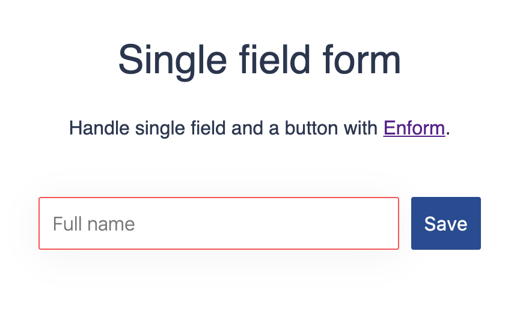

 # Documentation

 - Overview
 - Examples
    - Basic form (field and a button)
    - Newsletter form
    - Registration form
    - Form with dynamic elements
    - Full-featured form
  - API
  - `<Enform />` component props
    - children
    - initial
    - validation
  - `<Enform />` state API
    - values
    - errors
    - onChange
    - onSubmit
    - isDirty
    - validateField
    - clearError
    - clearErrors
    - clearFields
 - How to
    - handle validation
    - clear a form
    - submit a form
    - button state based on dirty state
    - handle contentEditable elements
    - handle form-like component

## Overview
Enform was born while trying to deal with forms in React repetitive times. Let's face it, things always end up the same. You start building your form components, adding some DOM and then it's time to handle interactions. The result is big state object to manage and a bunch of component methods to handle changes, submission and validation.

It feels like these should be hidden somehow or extracted in another component. Enform is such a component. **It hides the frustraction while still giving you the power of forms in React. And it's only 2 kB**.

Ok, enough theory, let's see some real use case examples.

## Examples
All examples in this section are available in [Codesandbox](https://codesandbox.io/s/basic-form-with-enform-dv69b) with the latest version of Enform. Feel free to experiment, fork or share. Ping me if you think I have messed something up 🤭.

### Basic form (field and a button)


```jsx
import React from "react";
import Enform from "enform";

const App = () => (
  <div>
    <h1>Simple form</h1>
    <Enform
      initial={{ name: "" }}
      validation={{ name: values => values.name === "" }}
    >
      {props => (
        <div>
          <input
            className={props.errors.name ? "error" : ""}
            type="text"
            value={props.values.name}
            onChange={e => {
              props.onChange("name", e.target.value);
            }}
          />
          <button onClick={props.onSubmit}>Submit</button>
        </div>
      )}
    </Enform>
  </div>
);
```
[](https://codesandbox.io/s/newsletter-form-with-enform-dv69b?fontsize=14&hidenavigation=1&theme=dark)

Few things to note here:
 - required `initial` prop is set with the field's default value
 - `validation` object defines that the field should not be empty
 - `props.onSubmit` is bound to the button click. It will submit whenever validation defined earlier is passed
 - the input field is fully controlled by using `props.values` and `props.onChange`.
___

### Newsletter form


```jsx
<Enform
  initial={{ email: "" }}
  validation={{
    email: values =>
      !/^[A-Za-z0-9._%+-]{1,64}@(?:[A-Za-z0-9-]{1,63}\.){1,125}[a-z]{2,63}$/.test(
        values.email
      )
  }}
>
  {props => (
    <div>
      <input
        className={props.errors.email ? "error" : ""}
        type="text"
        placeholder="Your email"
        value={props.values.email}
        onChange={e => {
          props.onChange("email", e.target.value);
        }}
      />
      <button onClick={props.onSubmit}>Submit</button>
    </div>
  )}
</Enform>
```
[](https://codesandbox.io/s/newsletter-form-with-enform-t1zyk?fontsize=14&hidenavigation=1&theme=dark)

In this example we have email `validation` based on a RegEx. Validator function will return `true` if email is invalid or `false` otherwise. All validators must return truthy value (either true or error message) if there is an error.
___

### Registration form


```jsx
<Enform
  initial={{
    user: "",
    email: "",
    password: "",
    repeatPassword: "",
    news: false
  }}
  validation={{
    // Other fields validation here
    password: values => {
      if (values.password.length < 6) {
        return "Password must be at least 6 chars in length!";
      } else if (values.password !== values.repeatPassword) {
        return "Password doesn't match!";
      }
      return false;
    },
    repeatPassword: values =>
      values.repeatPassword.length < 6
        ? "Password must be at least 6 chars in length!"
        : false
  }}
>
  {props => (
    <div className="Form">
      // Other fields DOM here
      <div className={errors.password ? "error" : ""}>
        <input
          type="password"
          placeholder="Password (min 6)"
          value={props.values.password}
          onChange={e => {
            props.onChange("password", e.target.value);
            if (props.errors.repeatPassword) {
              props.clearError("repeatPassword");
            }
          }}
        />
        <p>{props.errors.password}</p>
      </div>
      ...
    </div>
  )}
</Enform>
```
[](https://codesandbox.io/s/registration-form-with-enform-u6up9?fontsize=14&hidenavigation=1&theme=dark)

I have shortened this example, so that we can focus on two interesting parts - **password validation** and **clearing errors**. You can play with the [full demo in the codesandbox](https://codesandbox.io/s/registration-form-with-enform-u6up9?fontsize=14&hidenavigation=1&theme=dark).

In our registration form we want to display error messages as well. In order that to work each validator function must return the error string in case of an error. Otherwise it may return `false`. The `password` field validation depends on both password and repeatPassword, so it can display two different error messages.

**Second**, on the password `onChange` event we want to also clear the error for `repeatPassword`. Since `props.onChange("password", e.target.value)` will only clear password field's error we have to programatically clear the one for repeatPassword as well. This is done by calling `props.clearError("repeatPassword")`.
___

### Form with dynamic elements


```jsx
<Enform
  // Force Enform to reinitialize itself when adding/removing fields
  key={fieldNames.length}
  initial={{
    email: "",
    // Spread updated fields initial values -
    // stored in the component's state.
    ...this.state.fields
  }}
  validation={{
    email: values =>
      !/^[a-zA-Z0-9._%+-]{1,64}@(?:[a-zA-Z0-9-]{1,63}\.){1,125}[a-zA-Z]{2,63}$/.test(
        values.email
      ),
    // Spread the validation object for the rest of the fields -
    // stored in the component's state.
    ...this.state.fieldsValidation
  }}
>
  {props => (
    <div>
      {/* Map your newly added fields to render in the DOM */}
      {Object.keys(this.state.fields).map(field => (
        <div key={field}>
          <input
            className={props.errors[field] ? "error" : ""}
            type="text"
            placeholder="Email"
            value={props.values[field]}
            onChange={e => {
              props.onChange(field, e.target.value);
            }}
          />
          <button className="remove">Remove</button>
        </div>
      ))}
      <input
        className={props.errors.email ? "error" : ""}
        type="text"
        placeholder="Email"
        value={props.values.email}
        onChange={e => {
          props.onChange("email", e.target.value);
        }}
      />
      <button className="add">Add more</button>
      <button className="save">Save</button>
    </div>
  )}
</Enform>
```
[](https://codesandbox.io/s/dynamic-form-fields-with-enform-bnho9?fontsize=14&hidenavigation=1&theme=dark)

Enfrom does not automatically handle dynamic form elements (adding or removing felds), but you can make it aware of these changes with few adjustments. The example above is a short version of the [codesandbox demo](https://codesandbox.io/s/dynamic-form-fields-with-enform-bnho9?fontsize=14&hidenavigation=1&theme=dark).

**Let's start with the basics:** Enform wraps your form DOM and helps you handle its state changes. But you have to make Enform aware when your DOM changes - specifically if it is related to controlled fields. In this code snippet we **force Enform to reinitialize** when more fields are added or removed by setting the `key={fieldNames.length}` prop. Next step is to **update** the `initial` and `validation` props with the fields data. *Note that we have to keep track of this data ourself in our component state fx*. The last thing to do is to render all these newly added fields. Enform will do the rest as usual.
___

### Full-featured form


```jsx
<Enform
  initial={{
    email: "",
    password: "",
    age: "",
    frontend: false,
    backend: false,
    fullstack: false,
    devops: false,
    gender: "male",
    bio: "",
    news: false
  }}
  validation={{
    email: ({ email }) =>
      !/^[A-Za-z0-9._%+-]{1,64}@(?:[A-Za-z0-9-]{1,63}\.){1,125}[A-Za-z]{2,63}$/.test(
        email
      )
        ? "Enter valid email address!"
        : false,
    password: ({ password }) =>
      password.length < 6
        ? "Password must be at least 6 chars in length!"
        : false,
    age: ({ age }) => (age === "" ? "Select age range" : false),
    bio: ({ bio }) => (bio.length > 140 ? "Try to be shorter!" : false)
  }}
>
  {props => (
    <div className="form">
      <div>
        <input
          type="text"
          placeholder="Email"
          value={props.values.email}
          onChange={e => {
            props.onChange("email", e.target.value);
            // This will validate on every change.
            // The error will disappear once email is valid.
            if (props.errors.email) {
              props.validateField("email");
            }
          }}
        />
        <p>{props.errors.email}</p>
      </div>
      <div>
        <input
          type="password"
          placeholder="Password (min 6)"
          value={props.values.password}
          onChange={e => {
            props.onChange("password", e.target.value);
          }}
        />
        <p>{props.errors.password}</p>
      </div>
      <div>
        <select
          value={props.values.age}
          onChange={e => {
            props.onChange("age", e.target.value);
          }}
        >
          <option value="">What is your age</option>
          <option value="10-18">10 - 18</option>
          <option value="19-25">19 - 25</option>
          <option value="26-40">26 - 40</option>
          <option value="41-67">41 - 67</option>
        </select>
        <p>{props.errors.age}</p>
      </div>
      <label>You are:</label>
      <div>
        <input
          type="checkbox"
          id="frontend"
          checked={props.values.frontend}
          onChange={e => {
            props.onChange("frontend", e.target.checked);
          }}
        />
        <label htmlFor="frontend">front-end</label>
        <input
          type="checkbox"
          id="backend"
          checked={props.values.backend}
          onChange={e => {
            props.onChange("backend", e.target.checked);
          }}
        />
        <label htmlFor="backend">back-end</label>
        <input
          type="checkbox"
          id="fullstack"
          checked={props.values.fullstack}
          onChange={e => {
            props.onChange("fullstack", e.target.checked);
          }}
        />
        <label htmlFor="fullstack">full-stack</label>
        <input
          type="checkbox"
          id="devops"
          checked={props.values.devops}
          onChange={e => {
            props.onChange("devops", e.target.checked);
          }}
        />
        <label htmlFor="devops">dev-ops</label>
      </div>
      <label>Gender:</label>
      <div>
        <input
          type="radio"
          id="male"
          name="gender"
          value="male"
          checked={props.values.gender === "male"}
          onChange={() => {
            props.onChange("gender", "male");
          }}
        />
        <label htmlFor="male">male</label>
        <input
          type="radio"
          id="female"
          name="gender"
          value="female"
          checked={props.values.gender === "female"}
          onChange={() => {
            props.onChange("gender", "female");
          }}
        />
        <label htmlFor="female">female</label>
      </div>
      <div>
        <textarea
          type="text"
          placeholder="Short bio (max 140)"
          value={props.values.bio}
          onFocus={() => {
            // Clear the error on field focus
            props.clearError("bio");
          }}
          onChange={e => {
            props.onChange("bio", e.target.value);
          }}
        />
        <p>{props.errors.bio}</p>
      </div>
      <div>
        <input
          id="news"
          type="checkbox"
          checked={props.values.news}
          onChange={e => {
            props.onChange("news", e.target.checked);
          }}
        />
        <label htmlFor="news">
          Send me occasional product updates and offers.
        </label>
      </div>
      <button
        disabled={!props.isDirty()}
        type="reset"
        onClick={() => {
          // Enform doesn't provide reset() hook,
          // but here is how to achieve the same
          props.clearErrors();
          props.clearFields();
        }}
      >
        Clear
      </button>
      <button
        onClick={() => {
          props.onSubmit(values => {
            // You can call your own handler function here
            alert(JSON.stringify(values, null, " "));
          });
        }}
      >
        Send
      </button>
    </div>
  )}
</Enform>
```
[](https://codesandbox.io/s/full-featured-form-with-enform-qw3tu?fontsize=14&hidenavigation=1&theme=dark)

This example demonstrates how Enform can handle full-featured form. It uses all of its Api props and methods.

Few interesting areas:
 - **Passing custom callback to `onSubmit`.** In our case the handler is attached to the submit button and simply alerts the field values in pretty format.
 - **Resetting the form.** There is no `props.reset()` method, but we can achieve the same effect by combining `props.clearErrors()` and `props.clearFields()`.
 - **Clear error on focus.** This is done by calling `props.clearError()`. It is bound to the `onFocus` handler of the bio field in the demo.
 - **Validate on every change.** With the email field we have `props.validateField()` called from the `onChange`. It will trigger validation for this field on every change and will be cleared once the valid email is typed.
___

## API
`<Enform />` component wraps your form DOM (or custom component) and allows you to controll it via `props`. These are devided in two - props that you set to Enform directly and props that Enform passes down to your form component.

### Enform component props
You can set two props to Enform itself - `initial` and `validation`.
```jsx
<Enform
  initial={{ username: "" }}
  validation={{ username: values => values.username.length === 0 }}
>
  ...
</Enform>
```

#### `initial: { <field_name:string>: <initial_value:any> }` - required
This prop is the only required one. You need to set it, since it's the only way to tell Enform about your form structure. The initial value of each field should be a valid React element value, meaning that if you have `checkbox` fx. it make sense for the value to be `boolean`. The signature could be something like that `{ email: "", password: "", newsletter: false }`.

#### `validation: { <field_name:string>: <(values:object) => bool|string)> }`
This prop helps you specify fields validation conditions and errors. Don't set it if you don't need it. The `key` (field name) part should also be present in the `initial`. The `value` is a validation function which passes all field values down. It returns an **error message** when field is invalid or just a **boolean** if you don't need messages. With `{ username: values => values.username.length === 0 }` we return a boolean which simply reports if the field is empty. This is useful when you want to set an error class. Setting up  error messages is achieved with something like that `{ username: values => values.username.length === 0 ? "This field is required" : "" }`
___

### Enform state API
By taking care of your form's state Enform provides you with access to it by exposing several props and methods. These are passed down to your component via the `props` object.

```jsx
<Enform initial={{ name: "" }}>
  {props => (
    <form />
      ...
    </form>
  )}
</Enform>
```

#### `prop.values: { <field_name:string>: <value:string>}`
Object containing all field values. The signature is `{ key: value }` where `key` is the field name as defined in the `initial` and `value` is the current value of this element.

`props.values` gets updated when using `onChange` and `clearFields`.

#### `props.errors: { <field_name:string>: <value:bool|string>}`
Object containing errors for all fields. These are either the error messages or simply a true|false value. The signature is `{ key: value }` where `key` is the field name as defined in the `initial`. On the other side `value` contains the error message returned from the validator function as defined in `validation` or true. If there is no error it should be `false` or what is returned from your validation function.


`props.errors` gets updated when using `onChange`, `onSubmit`, `validateField`, `clearError` and `clearErrors`.

#### `props.onChange: (<field_name:string>, <value:string>) => void`
With this handler method you can set the value of a field.
```jsx
<Enform initial={{ email: "" }}>
  {props => (
    ...
    <input onChange={e => { props.onChange("email", e.target.value) }}>
  )}
</Enform>
```
As a side effect it will also **clear** any previously set error for that field.

#### `props.onSubmit: (<successCallback:function>) => void`
By calling `props.onSubmit()` you are telling Enform to do the following: trigger validation on all fields and either set the corresponding errors or call the `successCallback` function on success. Defining this callback is up to you. It takes the `values` object as an argument.

```jsx
<Enform initial={{ email: "" }}>
  {props => (
    <form onSubmit={e => {
      e.preventDefault();
      props.onSubmit(values => { console.log(values); });
    }}>
      ...
    </form>
  )}
</Enform>
```

#### `props.isDirty: () => bool`
If in need to know if current state of the form is dirty you can simply call `props.isDirty()`. It will return either true or false. Since it is an expensive operation Enform does't keep track of dirty state internally. It's up to you to use the function whenever needed. It performs comparison between field values and their `initial` values.

#### `props.validateField: (<field_name:string>) => bool`
Trigger validation for a single field. Ex. `props.validateField("email")`. That will call the validation function for the field (if any) and set the corresonding error message or boolean flag in `props.errors`. Common use case is if you want to validate while typing in an input field.

#### `props.clearError: (<field_name:string>) => void`
Clears the error for individual fields. Ex. `props.clearError("email")`. That will clear any error in the email field. Usually `props.onChange()` is doing it by default, but you may want to trigger validation let's say as part of `onFocus`.

```jsx
<Enform initial={{ email: "" }}>
  {props => (
    <input
      onFocus={e => {
        props.clearError("email");
      }}
      onChange={e => {
        props.onChange("email", e.target.value);
      }}
    />
  )}
</Enform>
```

#### `props.clearErrors: () => void`
Calling it will clear all errors in the form. Useful if want to reset the form. In that case you can do it as part of reset button's `onClick` handler.

#### `props.clearFields: () => void`
Clear all fields. Calling `props.clearFields` won't set the fields back to their `initial` values, but instead it will try to set each field to an empty state. This is done by evaluating the value types set as part of `initial` prop.
___

## How to
The idea of these short guides is to elaborate a little bit more on specific areas. Something we do often with our forms - validation, reseting/submitting, button states. It will also touch non trivial uses cases like handling `contentEditables`, **third party** integrations and form with `<div />` elements.

### Handle validation
Few quick validator function examples.

#### Simple error indication
```jsx
<Enform
  initial={{ name: "" }}
  validation={{ name: values => values.name.length === "" }}
>
```
If name field is empty `props.errors.name` will be set to `true`. Otherwise it's going to be `false`.

#### With error message
```jsx
<Enform
  initial={{ name: "" }}
  validation={{ name: values => (
    values.name.length === "" ? "This field can not be empty" : ""
  )}}
>
```
If name field is empty the `"This field can not be empty"` message will be stored in `props.errors.name` (truthy value). Otherwise it will have an empty string (falsy value).

#### Validation on field change
```jsx
<Enform
  initial={{ name: "" }}
  validation={{ name: values => values.name.length < 3 }}
>
  {props =>
    <input
      type="text"
      value={props.values.name}
      onChange={e => {
        props.onChange("name", e.target.value);
        props.validateField("name");
      }}
    />
  }
</Enform>
```
Our validator function for the name field will be called everytime user is typing in the field. This will cause `props.errors.name` to be updated constantly and cleared once the value reaches `3` chars in length.


#### Password validation
Tipical example is a registration form with a `password` and `repeatPassword` fields which need to be validated. You can also play with the [full demo of the form](https://codesandbox.io/s/registration-form-with-enform-u6up9?fontsize=14&hidenavigation=1&theme=dark).

```jsx
<Enform
  initial={{ name: "" }}
  validation={{
    password: values => {
      if (values.password.length < 6) {
        return "Password must be at least 6 chars in length!";
      } else if (values.password !== values.repeatPassword) {
        return "Password doesn't match!";
      }
      return false;
    },
    repeatPassword: values =>
      values.repeatPassword.length < 6
        ? "Password must be at least 6 chars in length!"
        : false
  }}
>
```
With this validation both password and repeatPassword will set error messages if the value length is less than `6`. The `props.errors.password` will also store error message when **values do not match**. This is an example on how several field values could be combined in single validator.
___

### Clear a form
Let's see how to clear a form on a button click:

```jsx
<Enform initial={{ name: "John" }}>
  {props =>
    <button
      onClick={() => {
        props.clearErrors();
        props.clearFields();
      }}
    >
      Clear
    </button>
  }
</Enform>
```
Clearing a form consists of two actions - **empty all fields** and **hide all errors**. Enform provides two methods which could be called on a button click - `props.clearFields` and `props.clearErrors()`. There is also a [full demo of the form](https://codesandbox.io/s/full-featured-form-with-enform-qw3tu?fontsize=14&hidenavigation=1&theme=dark) using clear button.
___

### Submit a form
There are few ways to handle form submission with Enform.

```jsx
<Enform initial={{ name: "John" }}>
  {props =>
    <button onClick={() => { props.onSubmit(); }}>
      Submit
    </button>
  }
</Enform>
```
Call `props.onSubmit()` as part of a button `onClick` handler.

or

```jsx
<Enform initial={{ name: "John" }}>
  {props =>
    <form onSubmit={e => {
      e.preventDefault();
      props.onSubmit();
    }}>
      ...
    </form>
  }
</Enform>
```
Call `props.onSubmit()` as part of a form element's `onSubmit` handler. Note that in this case you may need to also prevent the form's default behavior when submitting. This is because Enform works with controlled form elements.

What if you want to call an **Api endpoint** or do something with the **form values**. You can pass your own `successCallback`:

```jsx
<button onClick={() => {
  props.onSubmit(values => {
    console.log(values);
    // or pass the values to your own handler
  });
}}>
  Submit
</button>
```
If you provide success callback function to `props.onSubmit()` it will be called only if all fields are **passing their validation**. Example could be found in [the demo here](https://codesandbox.io/s/full-featured-form-with-enform-qw3tu?fontsize=14&hidenavigation=1&theme=dark).
___

### Button state based on dirty state
It is a common use case to enable/disable form buttons if dirty state changes. Let's see an example:

```jsx
<Enform initial={{ name: "John" }}>
  {props =>
    <button disabled={!props.isDirty()}>Submit</button>
  }
</Enform>
```
Here our submit button will render as disabled if form is not dirty, meaning - its fields are containing `initial` values.
___

### Handle contentEditable elements
contentEditable elements are sometimes very quirky. You often need to additionally manage cursor position and warnings in React. Below is a basic example of `contentEditable` div:

```jsx
<Enform initial={{ name: "Click me, I'm contentEditable" }}>
  {props => (
    <div
      contentEditable
      onInput={e => {
        props.onChange("name", e.target.innerText);
      }}
    >
      {props.values.name}
    </div>
  )}
</Enform>
```
The difference with the standard `<input />` is the `onInput` event handler, the text being in `e.target.innerText` and the value placed as a `child` of the div.
___

### Handle form-like component
All examples so far show that Enform works with controlled elements and components. It doesn't need to know about DOM structure or field types - this is up to you. **An interesting idea emerges - is it possible to manage the state of something that is not a form? `That is possible`.** Let's see this simple example.

```jsx
<Enform initial={{ label: "I am a label!" }}>
  {props => (
    <label
      onClick={() => {
        props.onChange("label", this.state.data.label);
      }}
    >
      {props.values.label}
    </label>
  )}
</Enform>
```
In this example the `<label />` element takes it's default text from the `initial` object and updates it onClick with some data comming from the consumer component's state. Cases like these could be expanded more, but the idea is that `it should be possible to use Enform for state management of anything that deals with values and their validation`.
___

<div align="center">The end!</div>
